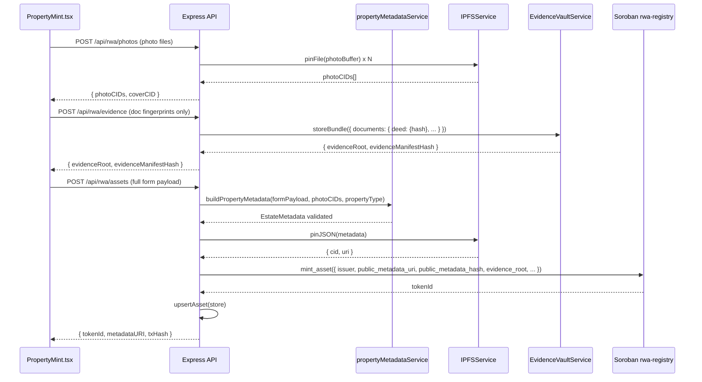

# Design Document: Zillow-Style RWA Property Listing

## Overview

Continuum's "List a Property" page (`/app/property-mint`) has been redesigned with a Zillow-inspired UI that captures rich, structured property metadata for two distinct property types: **ESTATE** (residential/commercial buildings) and **LAND** (raw parcels). This feature refactors the backend metadata schema, IPFS storage layer, API routes, agent screener, and evidence vault to support this expanded data model — while deliberately keeping the Soroban on-chain footprint minimal (token ID, owner, metadata URI, yield parameters as hashed references).

The design covers three concerns: (1) defining canonical JSON schemas for Estate and Land metadata that map 1:1 to every UI form field; (2) updating the Node.js/Express backend services to accept, validate, store, and return the new schemas; and (3) determining what — if anything — needs to change in the deployed Soroban contracts.

---

## Architecture

```mermaid
graph TD
    UI["PropertyMint.tsx\n/app/property-mint"] -->|multipart form + JSON| API["POST /api/rwa/assets\n(server/index.js)"]
    UI -->|photo files| PhotoAPI["POST /api/rwa/photos\n(new)"]
    UI -->|evidence fingerprints| EvidAPI["POST /api/rwa/evidence"]

    PhotoAPI -->|pin each image| IPFS["IPFSService\n(Pinata / local)"]
    IPFS -->|photo CIDs| PhotoAPI

    API -->|build full metadata object| MetaBuilder["buildPropertyMetadata()\n(new: propertyMetadataService.js)"]
    MetaBuilder -->|pin JSON| IPFS
    IPFS -->|metadataURI ipfs://CID| API

    API -->|storeBundle| EvidVault["EvidenceVaultService\n(evidenceVault.js)"]
    EvidVault -->|evidenceRoot, manifestHash| API

    API -->|mint_asset call| SorobanReg["RWA Registry Contract\n(rwa-registry)"]
    SorobanReg -->|tokenId| API

    API -->|upsertAsset| Store["IndexerStore\n(Postgres / Memory)"]

    AgentRuntime["AgentRuntimeService\ntick()"] -->|screenAssets()| Screener["assetScreener.js\nextractYieldRate()"]
    Screener -->|reads publicMetadata| Store
```

---

## Sequence Diagrams

### Mint Flow (Estate)



---

## Components and Interfaces

### propertyMetadataService.js (new)

**Purpose**: Canonical builder and validator for Estate and Land metadata objects. Single source of truth for the schema.

**Interface**:
```typescript
interface BuildPropertyMetadataOptions {
  propertyType: 'ESTATE' | 'LAND';
  formPayload: EstateFormPayload | LandFormPayload;
  photoCIDs: PhotoEntry[];
  coverCID: string;
}

function buildPropertyMetadata(opts: BuildPropertyMetadataOptions): EstateMetadata | LandMetadata
function validatePropertyMetadata(metadata: unknown): { valid: boolean; errors: string[] }
function extractYieldFieldsForChain(metadata: EstateMetadata | LandMetadata): YieldChainFields
```

**Responsibilities**:
- Map raw form fields to the canonical schema
- Compute derived fields (e.g. `pricePerSqft` if not supplied)
- Validate required fields per property type
- Produce the `yieldParameters` sub-object consumed by the agent screener

### ipfsService.js (extended)

**Purpose**: Add `pinFile()` for binary photo uploads alongside existing `pinJSON()`.

**New method**:
```typescript
async pinFile(
  buffer: Buffer,
  filename: string,
  mimeType: string
): Promise<{ cid: string; uri: string; pinned: boolean }>
```

### evidenceVault.js (extended)

**Purpose**: Accept client-side fingerprints (SHA-256 hashes computed in the browser) instead of requiring raw file bytes. The `normalizeDocumentEntry()` function is extended to accept a `filename` and `docType` field.

**Extended document entry**:
```typescript
interface EvidenceDocumentEntry {
  hash: string;        // SHA-256 hex, computed client-side via crypto.subtle
  filename: string;
  docType: string;     // 'title_deed' | 'appraisal' | 'survey' | 'inspection' | 'insurance' | 'tax' | 'other'
  issuedAt?: number;
  expiresAt?: number;
  issuer?: string;
  reference?: string;
  notes?: string;
}
```

### assetScreener.js (updated)

**Purpose**: `extractYieldRate()` updated to read the new `yieldParameters` fields from metadata.

**Updated extraction priority**:
1. Live yield stream data (unchanged — highest priority)
2. `metadata.yieldParameters.yieldTargetPct` (new)
3. `metadata.yieldParameters.monthlyRentalIncome` annualized (Estate)
4. `metadata.yieldParameters.annualLandLeaseIncome` (Land)
5. Legacy `metadata.monthlyYieldTarget` (backward compat)
6. Legacy `metadata.pricePerHour` (backward compat)

---

## Data Models

### Shared Sub-Objects

```typescript
interface PropertyAddress {
  street: string;
  city: string;
  state: string;
  zip: string;
  parcelNumber: string;   // APN
  latitude?: number;
  longitude?: number;
}

interface ListingInfo {
  mlsNumber?: string;
  agentName?: string;
  source?: string;        // "Zillow" | "MLS" | etc.
}

interface PropertyDescription {
  tags: string[];         // parsed from comma-separated input
  text: string;
}

interface PhotoEntry {
  cid: string;            // IPFS CID
  uri: string;            // ipfs://CID
  isCover: boolean;
}

interface YieldParametersEstate {
  yieldTargetPct: number;
  monthlyRentalIncome: number;
  annualizedRentalIncome: number;   // derived: monthlyRentalIncome * 12
}

interface YieldParametersLand {
  yieldTargetPct: number;
  annualLandLeaseIncome: number;
  appreciationNotes: string;
}
```

### EstateMetadata (IPFS public metadata, schemaVersion 3)

```typescript
interface EstateMetadata {
  schemaVersion: 3;
  propertyType: 'ESTATE';

  // Overview
  listPrice: number;
  zestimate?: number;
  beds: number;
  baths: number;
  sqft: number;
  yearBuilt?: number;
  lotSizeSqft?: number;
  pricePerSqft?: number;
  hoaMonthly?: number;
  estMonthlyPayment?: number;
  propertySubtype?: string;
  propertySubtypeDetail?: string;

  address: PropertyAddress;
  listing: ListingInfo;
  description: PropertyDescription;

  interior: {
    bedroomsCount: number;
    fullBaths: number;
    halfBaths: number;
    roomDimensions: {
      primaryBedroom?: string;
      bedroom2?: string;
      bedroom3?: string;
      kitchen?: string;
      livingRoom?: string;
    };
    heating?: string;
    cooling?: string;
    appliances?: string[];
    interiorFeatures?: string;
  };

  construction: {
    homeType?: string;
    architecturalStyle?: string;
    levels?: string;
    stories?: number;
    patioPorch?: string;
    spa?: string;
    exteriorMaterials?: string[];
    foundation?: string;
    roof?: string;
    condition?: string;
  };

  parkingAndLot: {
    parkingFeatures?: string;
    carportSpaces?: number;
    uncoveredSpaces?: number;
    lotSizeAcres?: number;
    lotDimensions?: string;
    otherEquipment?: string[];
    lotFeatures?: string;
  };

  photos: PhotoEntry[];
  yieldParameters: YieldParametersEstate;

  // Legacy compat (for existing agent screener and mapApiAssetToUiAsset)
  name: string;                 // derived: "{beds}bd/{baths}ba at {address.street}"
  location: string;             // derived: "{city}, {state}"
  monthlyYieldTarget: number;   // alias: yieldParameters.monthlyRentalIncome
  propertyRef: string;
  tagSeed: string;
  rightsModel: string;
}
```

### LandMetadata (IPFS public metadata, schemaVersion 3)

```typescript
interface LandMetadata {
  schemaVersion: 3;
  propertyType: 'LAND';

  // Land Overview
  listPrice: number;
  zestimate?: number;
  lotSizeAcres: number;
  lotDimensions?: string;
  hoaAnnual?: number;
  zoning?: string;
  landType?: string;

  address: PropertyAddress;
  listing: ListingInfo;
  description: PropertyDescription;

  landDetails: {
    topography?: string;
    soilType?: string;
    roadAccess?: string;
    utilities?: string[];
    waterSource?: string;
    floodZone?: string;
    treeCover?: string;
    surveyAvailable?: 'yes' | 'no' | 'pending';
  };

  landUse: {
    history?: string;
    additionalNotes?: string;
  };

  photos: PhotoEntry[];
  yieldParameters: YieldParametersLand;

  // Legacy compat
  name: string;                 // derived: "{lotSizeAcres} acres at {address.street}"
  location: string;             // derived: "{city}, {state}"
  monthlyYieldTarget: number;   // alias: annualLandLeaseIncome / 12
  propertyRef: string;
  tagSeed: string;
  rightsModel: string;
}
```

### On-Chain AssetRecord (Soroban — unchanged)

The existing `AssetRecord` struct stores: `token_id`, `asset_type`, `rights_model`, `public_metadata_uri`, `public_metadata_hash`, `evidence_root`, `evidence_manifest_hash`, `property_ref_hash`, `cid_hash`, `tag_hash`, `jurisdiction`, `verification_status`, `current_owner`, `issuer`.

**No Soroban contract changes are required.** Yield parameters are stored in IPFS metadata JSON and referenced on-chain only via `public_metadata_hash`.

---

## Algorithmic Pseudocode

### Main Mint Workflow

```pascal
ALGORITHM mintPropertyRWA(req)
INPUT: req.body = { propertyType, formPayload, photoCIDs, coverCID,
                    evidenceRoot, evidenceManifestHash, issuer, jurisdiction }
OUTPUT: { tokenId, metadataURI, txHash }

BEGIN
  ASSERT propertyType IN ['ESTATE', 'LAND']
  ASSERT issuer IS valid Stellar public key

  metadata <- buildPropertyMetadata({ propertyType, formPayload, photoCIDs, coverCID })

  validationResult <- validatePropertyMetadata(metadata)
  IF NOT validationResult.valid THEN
    RETURN HTTP 400 { errors: validationResult.errors }
  END IF

  { cid, uri } <- ipfsService.pinJSON(metadata)
  publicMetadataHash <- sha256Hex(stableStringify(metadata))
  cidHash <- sha256Hex(cid)
  propertyRef <- buildPropertyRef(formPayload.address)
  propertyRefHash <- sha256Hex(propertyRef)
  tagSeed <- buildTagSeed(issuer, propertyRef)
  tagHash <- sha256Hex(tagSeed)

  tokenId <- contractService.invokeWrite({
    method: 'mint_asset',
    args: {
      issuer, asset_type: 1, rights_model: 1,
      public_metadata_uri: uri, public_metadata_hash: publicMetadataHash,
      evidence_root: evidenceRoot, evidence_manifest_hash: evidenceManifestHash,
      property_ref_hash: propertyRefHash, jurisdiction,
      cid_hash: cidHash, tag_hash: tagHash, status_reason: ''
    }
  })

  store.upsertAsset({
    tokenId, publicMetadataURI: uri, publicMetadata: metadata,
    evidenceRoot, evidenceManifestHash, propertyRefHash, publicMetadataHash,
    issuer, currentOwner: issuer, assetType: 1, verificationStatus: 0
  })

  RETURN { tokenId, metadataURI: uri, txHash }
END
```

### Photo Upload Algorithm

```pascal
ALGORITHM uploadPropertyPhotos(req)
INPUT: req.files = File[], req.body.coverIndex = number
OUTPUT: { photos: PhotoEntry[], coverCID: string }

BEGIN
  ASSERT files.length <= 20
  FOR each file IN files DO
    ASSERT file.mimetype STARTS WITH 'image/'
    ASSERT file.size <= 10_485_760
  END FOR

  photos <- []
  FOR i, file IN enumerate(files) DO
    { cid, uri } <- ipfsService.pinFile(file.buffer, file.originalname, file.mimetype)
    photos.push({ cid, uri, isCover: i === coverIndex })
  END FOR

  coverCID <- photos[coverIndex].cid IF coverIndex < photos.length ELSE photos[0].cid
  RETURN { photos, coverCID }
END
```

### Evidence Bundle Fingerprint Algorithm

```pascal
ALGORITHM storeEvidenceBundle(req)
INPUT: req.body = {
  documents: { [docType]: { hash, filename, docType, issuedAt?, expiresAt?, issuer?, reference? } },
  rightsModel, propertyRef, jurisdiction
}
OUTPUT: { evidenceRoot, evidenceManifestHash }

BEGIN
  // Client computed SHA-256 hashes locally; server never receives raw file bytes
  FOR each docEntry IN documents DO
    ASSERT docEntry.hash IS 64-char hex string
    ASSERT docEntry.docType IN ALLOWED_DOC_TYPES
  END FOR

  record <- evidenceVault.storeBundle({ documents, rightsModel, propertyRef, jurisdiction })
  RETURN { evidenceRoot: record.evidenceRoot, evidenceManifestHash: record.evidenceManifestHash }
END
```

### Updated extractYieldRate (assetScreener.js)

```pascal
ALGORITHM extractYieldRate(asset)
INPUT: asset with publicMetadata
OUTPUT: annualizedYieldPct (0-999)

BEGIN
  // Priority 1: Live yield stream (unchanged)
  stream <- asset.stream
  IF stream AND stream.totalAmount > 0 AND stream.durationSeconds > 0 THEN
    annualRate <- (stream.totalAmount / stream.durationSeconds) * 31536000
                  / MAX(stream.depositedAmount, 1) * 100
    RETURN MIN(annualRate, 999)
  END IF

  metadata <- asset.publicMetadata OR asset.metadata OR {}
  yp <- metadata.yieldParameters

  // Priority 2: New yieldParameters block
  IF yp THEN
    IF yp.yieldTargetPct > 0 THEN RETURN MIN(yp.yieldTargetPct, 999) END IF
    IF yp.monthlyRentalIncome > 0 AND metadata.listPrice > 0 THEN
      RETURN MIN((yp.monthlyRentalIncome * 12 / metadata.listPrice) * 100, 999)
    END IF
    IF yp.annualLandLeaseIncome > 0 AND metadata.listPrice > 0 THEN
      RETURN MIN((yp.annualLandLeaseIncome / metadata.listPrice) * 100, 999)
    END IF
  END IF

  // Priority 3: Legacy fields (backward compat)
  IF metadata.monthlyYieldTarget > 0 THEN
    RETURN MIN((metadata.monthlyYieldTarget * 12 / 1000) * 100, 999)
  END IF
  IF metadata.pricePerHour > 0 THEN
    RETURN MIN((metadata.pricePerHour * 24 * 365 / 1000) * 100, 999)
  END IF

  RETURN 0
END
```

---

## Key Functions with Formal Specifications

### buildPropertyMetadata(opts)

**Preconditions:**
- `opts.propertyType` is `'ESTATE'` or `'LAND'`
- `opts.formPayload` is a non-null object
- `opts.photoCIDs` is an array (may be empty)

**Postconditions:**
- Returns object with `schemaVersion: 3` and `propertyType` matching input
- `metadata.name` is a non-empty derived string
- `metadata.yieldParameters` is present and typed correctly for the property type
- `metadata.monthlyYieldTarget` is set for backward compat with existing agent screener
- All numeric fields parsed from string inputs are finite numbers or `undefined`

**Loop Invariants:** N/A (pure transformation, no loops)

### validatePropertyMetadata(metadata)

**Preconditions:** `metadata` is any value (may be null/undefined)

**Postconditions:**
- Returns `{ valid: true, errors: [] }` if all required fields are present and typed correctly
- Returns `{ valid: false, errors: [...] }` with at least one error message if invalid
- Never throws; all errors captured in the `errors` array

**Loop Invariants:**
- For each field checked: all previously validated fields remain valid when loop continues

### ipfsService.pinFile(buffer, filename, mimeType)

**Preconditions:**
- `buffer` is a non-empty Buffer, `buffer.length <= 10_485_760`
- `mimeType` starts with `'image/'` or is an allowed document MIME type

**Postconditions:**
- If Pinata JWT configured: file pinned to Pinata, `pinned: true`, real IPFS CID returned
- If no JWT: deterministic local hash, `pinned: false`
- `uri` is always `ipfs://${cid}`
- `localPins` map updated with the result

### extractYieldFieldsForChain(metadata)

**Preconditions:** `metadata` has a `yieldParameters` field

**Postconditions:**
- `yieldTargetPct` is a finite non-negative number
- `primaryIncomeUsd` is a finite non-negative number
- `incomeType` correctly reflects the property type (`'monthly_rental'` or `'annual_lease'`)

---

## Error Handling

### Photo Upload Errors

| Condition | HTTP Status | Response |
|-----------|-------------|----------|
| File count > 20 | 400 | `{ error: "Maximum 20 photos allowed" }` |
| File size > 10MB | 400 | `{ error: "Photo exceeds 10MB limit", filename }` |
| Non-image MIME type | 400 | `{ error: "Only image files are accepted" }` |
| Pinata API failure | 502 | `{ error: "Photo storage failed", code: "ipfs_pin_failed" }` |

### Metadata Validation Errors

| Condition | HTTP Status | Response |
|-----------|-------------|----------|
| Missing `propertyType` | 400 | `{ error: "propertyType is required (ESTATE or LAND)" }` |
| Missing `listPrice` | 400 | `{ error: "listPrice is required" }` |
| Missing address fields | 400 | `{ error: "address.street, city, state, zip are required" }` |
| Invalid `yieldTargetPct` | 400 | `{ error: "yieldTargetPct must be between 0 and 100" }` |

### Mint Errors

| Condition | HTTP Status | Response |
|-----------|-------------|----------|
| Issuer not approved on-chain | 409 | `{ error: "...", code: "issuer_not_onboarded" }` |
| IPFS pin failed | 502 | `{ error: "Metadata storage failed", code: "ipfs_pin_failed" }` |
| Soroban contract error | 500 | `{ error: "...", code: "contract_error" }` |

---

## Correctness Properties

*A property is a characteristic or behavior that should hold true across all valid executions of a system — essentially, a formal statement about what the system should do. Properties serve as the bridge between human-readable specifications and machine-verifiable correctness guarantees.*

### Property 1: buildPropertyMetadata is total and always returns schemaVersion 3

*For any* object with a valid `propertyType` (`'ESTATE'` or `'LAND'`) and a non-empty `listPrice`, calling `buildPropertyMetadata()` SHALL complete without throwing and SHALL return an object with `schemaVersion: 3`.

**Validates: Requirements 1.2, 1.3, 1.4, 1.5**

### Property 2: buildPropertyMetadata output always passes validatePropertyMetadata

*For any* valid Estate or Land `formPayload`, the metadata object returned by `buildPropertyMetadata()` SHALL satisfy `validatePropertyMetadata()` returning `{ valid: true, errors: [] }`.

**Validates: Requirements 1.1, 1.2, 1.3, 2.2, 2.5**

### Property 3: extractYieldRate is monotone with respect to yieldTargetPct

*For any* two otherwise-identical assets (no live stream data) where asset A has a higher `yieldParameters.yieldTargetPct` than asset B, `extractYieldRate(A)` SHALL be greater than or equal to `extractYieldRate(B)`.

**Validates: Requirements 6.1, 6.7**

### Property 4: IPFS round-trip preserves metadata

*For any* valid metadata object, calling `pinJSON(metadata)` followed by `fetchJSON(cid)` SHALL return an object deeply equal to the original metadata.

**Validates: Requirement 4.1**

### Property 5: pinFile always sets uri to ipfs://cid

*For any* valid image buffer and filename, `pinFile()` SHALL return an object where `uri === 'ipfs://' + cid`.

**Validates: Requirement 3.4**

### Property 6: normalizeDocumentEntry preserves valid hash values

*For any* document entry object containing a valid 64-character hexadecimal `hash` string, `normalizeDocumentEntry()` SHALL return an object whose `hash` field equals the original input hash.

**Validates: Requirements 5.2, 5.3**

---

## Testing Strategy

### Unit Testing Approach

- `buildPropertyMetadata()`: complete Estate payload, complete Land payload, minimal required-only payload, missing required fields
- `validatePropertyMetadata()`: all required field combinations, boundary values for numeric fields, invalid types
- `extractYieldRate()`: new `yieldParameters` block (Estate), new `yieldParameters` block (Land), legacy `monthlyYieldTarget`, legacy `pricePerHour`, live stream data (should take priority), empty metadata

### Property-Based Testing Approach

**Property Test Library**: fast-check

**Properties to test:**

1. `buildPropertyMetadata` is total — for any object with `propertyType: 'ESTATE'` and non-empty `listPrice`, it never throws and always returns `schemaVersion: 3`

2. Consistency — any metadata produced by `buildPropertyMetadata` with valid inputs passes `validatePropertyMetadata`

3. `extractYieldRate` is monotone with respect to `yieldTargetPct` — if `yieldTargetPct` increases, extracted yield rate never decreases (when no stream data present)

4. Round-trip — `pinJSON(metadata)` followed by `fetchJSON(cid)` returns an object deeply equal to the original

### Integration Testing Approach

- Full mint flow: POST `/api/rwa/photos` → POST `/api/rwa/evidence` → POST `/api/rwa/assets` → GET `/api/rwa/assets/:tokenId` returns hydrated asset with full metadata
- Agent screener: Estate asset with `yieldTargetPct: 8.5` ranks above asset with `yieldTargetPct: 5.0`
- Backward compat: existing assets with only `monthlyYieldTarget` continue to be screened correctly

---

## Performance Considerations

- Photo uploads: sequential per file with concurrency limit of 3 parallel Pinata pins for up to 20 photos
- `buildPropertyMetadata` is synchronous and CPU-bound; no caching needed
- IPFS metadata fetch uses existing `localPins` cache in `IPFSService`; no change needed
- `validatePropertyMetadata` completes in < 1ms; no async I/O

---

## Security Considerations

- **Private evidence bundle**: Raw document files are never sent to the server. The browser computes SHA-256 hashes client-side via `crypto.subtle.digest`. Only the hash, filename, and metadata are transmitted. Sensitive legal documents (title deeds, appraisals) never leave the user's device.
- **Photo files**: Public by design (IPFS). Server validates MIME type and size before pinning.
- **Metadata sanitization**: All string fields are trimmed and length-capped before inclusion in IPFS metadata. No HTML or script injection possible since metadata is JSON-only.
- **Issuer authorization**: Existing `get_issuer_approval` check on Soroban contract is unchanged and still enforced before minting.
- **No new on-chain storage**: Yield parameters stored only in IPFS metadata, not on-chain. Avoids exposing financial details to all chain observers.

---

## Dependencies

| Dependency | Purpose | Change Required |
|------------|---------|-----------------|
| `multer` | Multipart form parsing for photo uploads | Add to `server/package.json` |
| Pinata (via fetch) | IPFS pinning for binary files | Extend `IPFSService.pinFile()` |
| `fast-check` | Property-based testing | Add to dev dependencies |
| Soroban `rwa-registry` | On-chain minting | No contract changes needed |
| Soroban `yield-vault` | Yield streaming | No contract changes needed |
| `server/services/propertyMetadataService.js` | New service | Create new file |
| `server/routes/continuum.js` | Add photo upload route | Extend existing file |
| `server/services/assetScreener.js` | Update `extractYieldRate()` | Modify existing function |
| `server/services/evidenceVault.js` | Accept client-side fingerprints | Extend `normalizeDocumentEntry()` |

---

## Soroban Contract Assessment

**Decision: No contract redeployment required.**

The existing `AssetRecord` struct in `rwa-registry` already stores `public_metadata_uri` (points to IPFS JSON containing all yield parameters) and `public_metadata_hash` (SHA-256 of full metadata, enabling integrity verification). The new yield fields belong in the IPFS metadata layer, not on-chain, because:

1. They are mutable — updating on-chain would require a write transaction per update
2. They are financial data that should not be permanently public on a blockchain ledger
3. The agent screener already hydrates metadata from IPFS before screening, so it can read these fields without any contract changes

The `yield-vault` contract is also unchanged — it operates on token amounts and stream IDs, not property metadata.

**Estate vs Land on-chain**: Both map to `asset_type: 1`. The `propertyType: 'ESTATE' | 'LAND'` distinction is carried in IPFS metadata and surfaced by `inferMarketAssetClass()` in `rwaAssetScope.js` via keyword detection on metadata fields. No contract change needed.
